<p align="center">
  
</p>


<p align="center"><em>Fem un vermut?</em></p>

A street that needs cleaning, a pavement in need of repair, a question about
paperwork: everyday contact with the council offers a particular view of life
in Barcelona. IRIS records incidents, complaints, suggestions, inquiries, and
messages of gratitude. Read together, they let us ask when people report,
what they report about, and which parts of that conversation we can see.

The plots below tell that story one step at a time. Each has a short guide to
reading it, an interpretation grounded in the numbers, and an explanation of
what it can mean for city life. The limits stay beside the findings, where
readers can judge them.

IRIS measures **reported citizen activity**. It does not capture every urban
issue, establish causation, or directly measure service quality.

## Open the work

- **[Illustrated reading guide](reports/iris_signal_summary.md)** — findings,
  all 13 plots, an individual interpretation for each, and supporting tables.
- **[Standalone report](reports/iris_exploration.html)** — open the downloaded
  file in a browser. It contains all charts and 13 downloadable aggregate CSV
  tables, works offline, and can be shared as one file. GitHub displays the
  source; download the file to view the rendered report.
- **Local explorer:** `.venv/bin/python -m streamlit run streamlit_app.py`.
  Filter dates, request areas, districts (including missing), and channels;
  inspect sample records and download the filtered aggregate tables.
- **[Category and observation decisions](reports/iris_category_decisions.md)**
  explain the closure-year selection, source label changes, and denominators.

## Where the project is now

Discovery and conservative preparation are complete for one locally preserved
2025 IRIS export. The descriptive exploration now has reproducible plots,
aggregate tables, an illustrated report, and an existing local viewer with
consistent calculations. The live catalog was checked again on 2026-09-27;
this review retained the original local download.

| Stage | Records | Meaning |
| --- | ---: | --- |
| Original export | 287,304 | All original rows, including exact duplicates |
| Exact duplicate rows removed | 3,393 | No other deduplication or imputation |
| Prepared records | 283,911 | All observed closure dates are in 2025 |
| Earlier registrations | 5,283 | Retained in the prepared file; outside headline charts |
| Headline cohort | 278,628 | Registered **and** closed in 2025 |

**The headline cohort is not a complete count of requests registered in 2025.**
Requests still open or closed in another year are absent. A late-December
registration must close quickly to appear in this file. Falling year-end
counts or lags cannot establish falling demand or faster service.

<!-- BEGIN IRIS PLOT READINGS -->

## A walk through the plots

These readings follow three commitments: ethos, earn trust by showing where the evidence comes from and where it stops; logos, make the numbers and comparisons understandable; pathos, connect them to the shared places and public services people care about. Everyday examples explain why a pattern could matter; they are not accounts of individual people in the data.

All thirteen plots are shown below. Follow the story in order, or jump to a reading:

- [1. The rhythm of asking the city for help](#1-the-rhythm-of-asking-the-city-for-help)
- [2. Reporting follows the working week](#2-reporting-follows-the-working-week)
- [3. The calendar gives each day a context](#3-the-calendar-gives-each-day-a-context)
- [4. December shows the edge of the dataset](#4-december-shows-the-edge-of-the-dataset)
- [5. Much of the conversation concerns shared public space](#5-much-of-the-conversation-concerns-shared-public-space)
- [6. Many reports have no district on the map](#6-many-reports-have-no-district-on-the-map)
- [7. Geography is missing for different kinds of requests](#7-geography-is-missing-for-different-kinds-of-requests)
- [8. Districts differ in the mix of requests we can place](#8-districts-differ-in-the-mix-of-requests-we-can-place)
- [9. The route into the system shapes what becomes visible](#9-the-route-into-the-system-shapes-what-becomes-visible)
- [10. A typical closure time leaves a long tail out of view](#10-a-typical-closure-time-leaves-a-long-tail-out-of-view)
- [11. Different requests have different closure timelines](#11-different-requests-have-different-closure-timelines)
- [12. Busy days do not tell the whole story of closure lag](#12-busy-days-do-not-tell-the-whole-story-of-closure-lag)
- [13. The labels change, so the story needs a pause](#13-the-labels-change-so-the-story-needs-a-pause)

### 1. The rhythm of asking the city for help

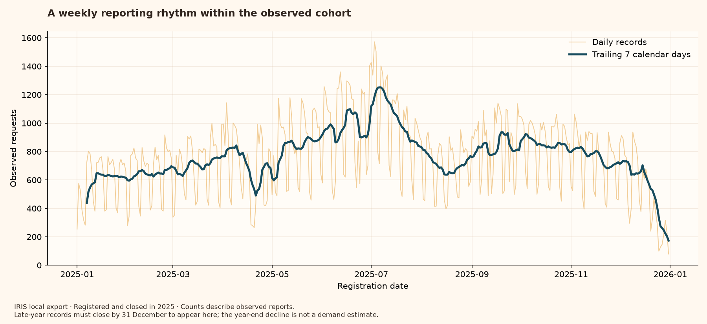

*The gold line counts records by registration date; the blue line averages seven complete calendar days so the broader movement is easier to see.*

The line rises and falls repeatedly through a year containing 278,628 reports. The median day has 784; the largest daily count is 1,572, on 3 July. Those sharp teeth invite us to look for a weekly reporting rhythm before searching for exceptional events.

Submitting a request is one way to bring an everyday concern to the council's attention. Seen together, these records show when that contact enters IRIS. The blue line helps us follow the changing pace without letting a single busy day dominate the story.

A registration date tells us when a request entered the system, not when the underlying issue began. Only requests closed in 2025 appear here, so the fall near December cannot by itself show that the city needed less help.

### 2. Reporting follows the working week

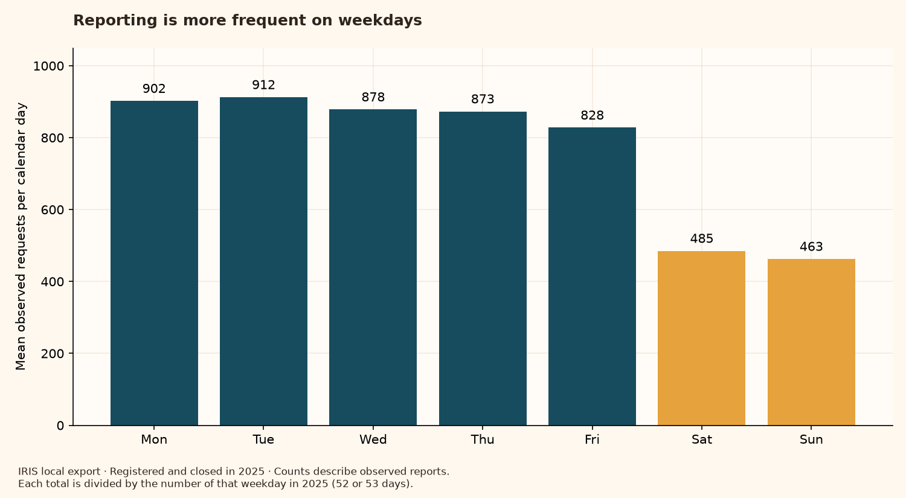

*Each bar divides that weekday's total by the number of times it occurs in the year: 53 Wednesdays and 52 of each other weekday.*

Weekdays average 879 reports, compared with 474 at weekends: 1.85 times as many. Tuesday has the highest mean (912), and Sunday the lowest (463). The contrast is visible across the working week.

People fit contact with public services around their lives, and municipal channels have their own routines. Those are plausible contributors to this pattern. For someone planning a fair comparison, the practical lesson is to compare a Tuesday with similar weekdays before describing it as unusually busy.

The records do not measure opening hours, people's schedules, or all unreported concerns. A lower Sunday bar does not establish that fewer problems occurred that day, and this chart cannot separate the possible explanations.

### 3. The calendar gives each day a context

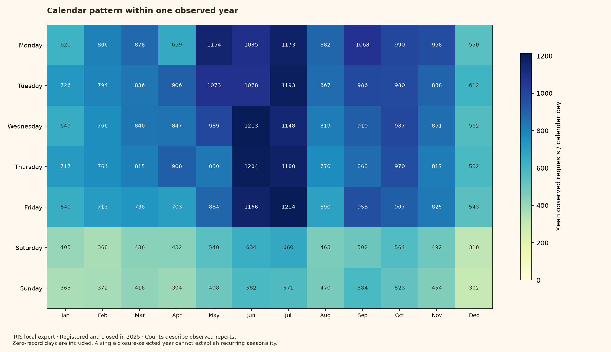

*Choose a month along the bottom and a weekday on the left. The number in their square is the average daily count for that combination; darker squares mean more reports.*

Fridays in July average 1,214 reports, compared with 640 in January. Weekend cells remain lighter than working-day cells across the year. Together, the two directions show why neither the weekday nor the month alone captures the whole reporting pattern.

For anyone trying to understand a busy day, its place in the calendar matters. Comparing similar weekdays in similar parts of the year gives us a more useful starting point for asking when reports tend to accumulate, without treating every peak as a special event.

Each square averages only four or five days. Holidays and a few unusual days can affect it. We have one year of selected completed records: the heatmap does not establish a repeating seasonal pattern, a tourism effect, or a weather effect.

### 4. December shows the edge of the dataset

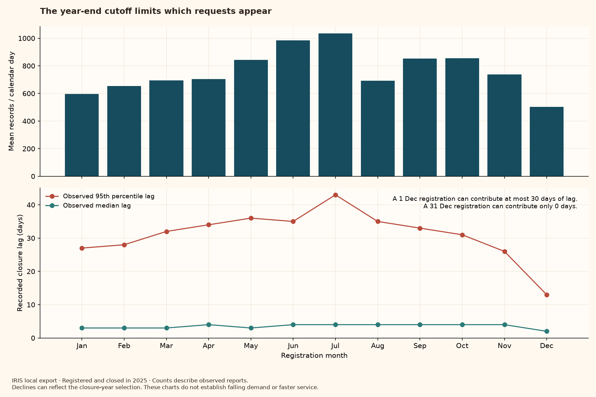

*The upper panel shows mean daily reports by registration month. Below it are the median recorded closure lag and the 95th percentile, the point at or below which 95% of observed lags fall.*

The observed daily mean is highest in July, at 1,035; December's is 503. December also has a median lag of 2 days. These lower numbers are tempting to read as less pressure or faster service, but the file has a fixed boundary: every included request closed by 31 December.

Consider a request registered on 1 December. It can appear here with at most 30 days between registration and closure. A request registered on 31 December must close that same day. An unresolved concern can still matter to the person reporting it even when it falls outside this particular export.

This boundary can lower both the observed count and the observed lag late in the year; it does not tell us how much of the decline it explains. We need later closure records and comparable follow-up periods before judging changes in demand or closure speed.

### 5. Much of the conversation concerns shared public space

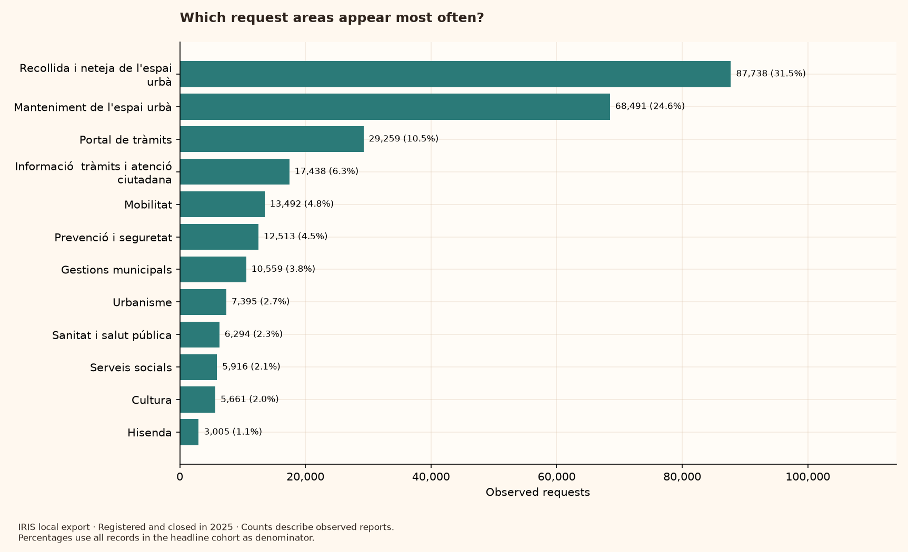

*Bar length shows the number of reports in each displayed request area. The percentage beside it uses all headline records as its denominator, including areas outside the chart.*

Cleaning and collection (Recollida i neteja de l'espai urbà) account for 87,738 reports. Public-space maintenance (Manteniment de l'espai urbà) adds 68,491. Together that is 56.1% of the cohort: more than half of the records in this view concern these two areas.

Street cleanliness, pavements, and the upkeep of shared spaces are close to everyday city life. Their prominence makes this a concrete place to begin asking what citizens bring to the council's attention. It grounds the next analytical question in recognisable concerns about places people share.

Frequency is not a measure of severity. Several reports may refer to the same issue, and difficult or poorly reported problems may occupy small bars. The plot describes the published requests, not a ranking of everything that matters to Barcelona's residents.

### 6. Many reports have no district on the map

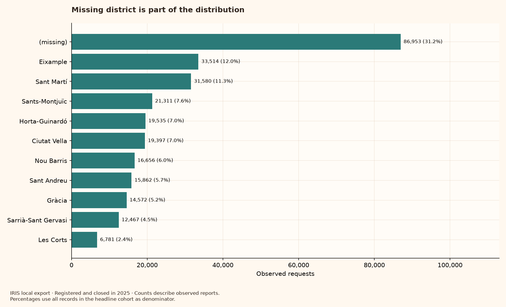

*Each bar counts records assigned to a district; the '(missing)' bar counts records without a published district. Percentages refer to the entire headline cohort.*

86,953 reports, or 31.2%, have no district. Among named districts, Eixample has the largest count (33,514). Keeping the missing group in view makes the coverage gap visible before any geographic comparison.

A map can feel like a complete picture of a city. Here, drawing only the records we can place would leave nearly one third of the selected reports outside that picture. Keeping them visible helps us remember that a request can be relevant even when it cannot be assigned to a district.

A higher district count does not establish greater need, more problems per resident, or worse service. Districts differ in population, activity, and reporting habits, and none of those differences has been adjusted for here. Missing district also need not mean the publisher failed to locate a place-specific issue.

### 7. Geography is missing for different kinds of requests

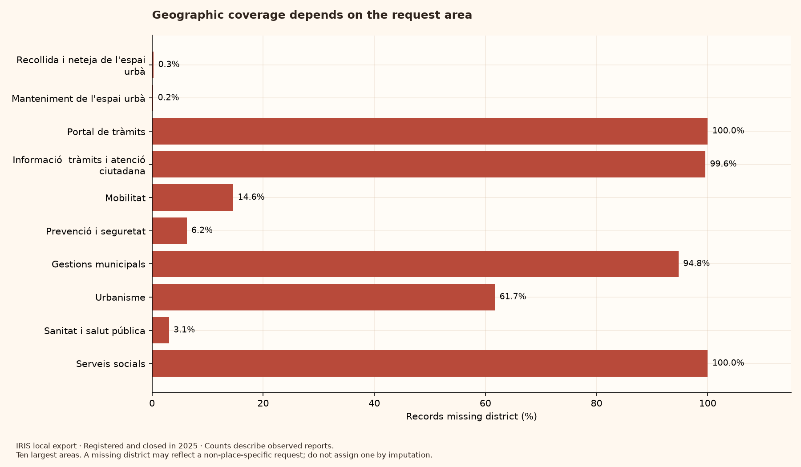

*For each of the ten largest areas, the bar is the percentage of its records without a district. A longer bar means less geographic information, not more requests.*

Only 0.28% of cleaning records and 0.21% of maintenance records lack a district. For the administrative portal (Portal de tràmits), the missing share is 100%. The gap is strongly associated with the kind of request.

A damaged pavement has a physical location; a question about an online procedure may not. That difference is one plausible explanation for the contrast. If we keep only records with a district, we consequently hear much more about physical public space and much less about administrative services.

The file does not establish why any individual location is absent. We should neither invent districts to fill the gaps nor assume that records with a district represent the rest. Geographic filtering changes the question the analysis can answer.

### 8. Districts differ in the mix of requests we can place

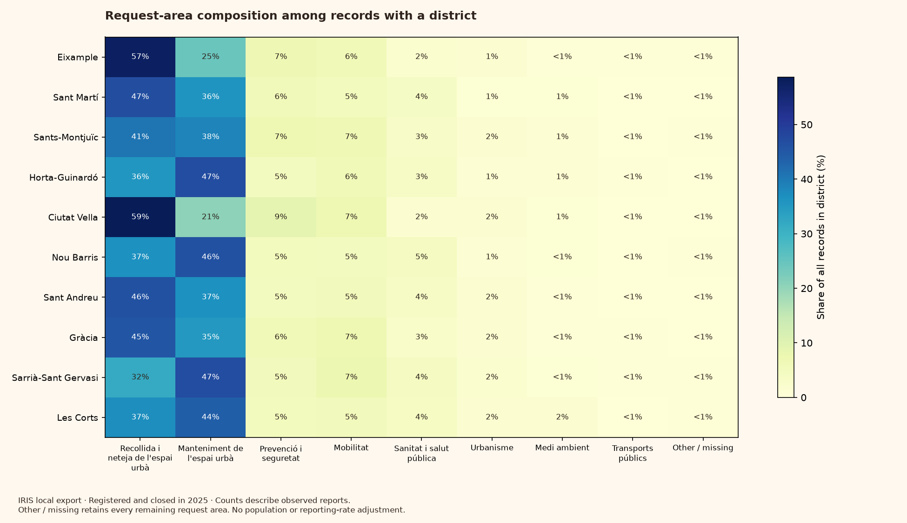

*Read across a district's row. Its percentages describe how that district's observed reports are divided among request areas; each row totals 100% before rounding.*

In Ciutat Vella, cleaning accounts for 58.7% of located reports and maintenance for 20.5%. In Horta-Guinardó, the corresponding shares are 35.6% and 47.0%. The balance of these two large categories is visibly different.

This invites a more specific local conversation: what kinds of concerns are reaching the council from each district? Looking at composition helps us see differences that a single citywide total would hide, while avoiding the assumption that every district's reported needs look alike.

A larger share of cleaning reports does not establish dirtier streets. A share can rise because other types of requests fall, and this chart excludes records with no district. It contains no adjustment for residents, visitors, or willingness and ability to report.

### 9. The route into the system shapes what becomes visible

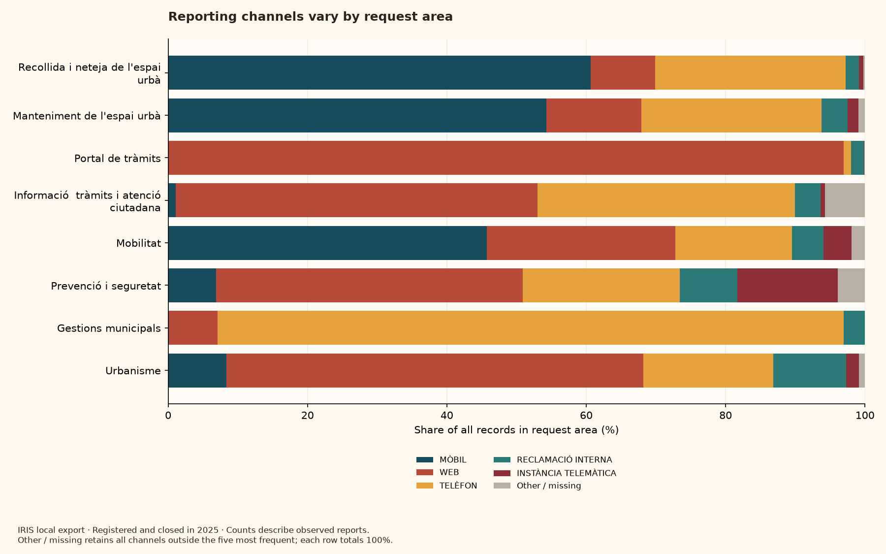

*Each horizontal bar represents all reports in one request area. Its coloured segments show reporting-channel shares; Other / missing preserves the channels outside the five displayed leaders.*

Mobile (MÒBIL) accounts for 60.7% of cleaning reports and 54.3% of maintenance reports. Web accounts for 96.9% of administrative portal requests. Different categories reach IRIS through markedly different routes.

Someone noticing an issue on a street and someone trying to complete an online procedure may approach the council differently. The chart makes that a useful question about access and reporting context. Understanding public concerns also requires understanding the routes by which those concerns become records.

These records do not identify who could not use a channel or why a channel was chosen. Differences may reflect request mix, available services, or administrative routing. They do not establish digital exclusion, citizen preferences, or a causal effect of channel on closure speed.

### 10. A typical closure time leaves a long tail out of view

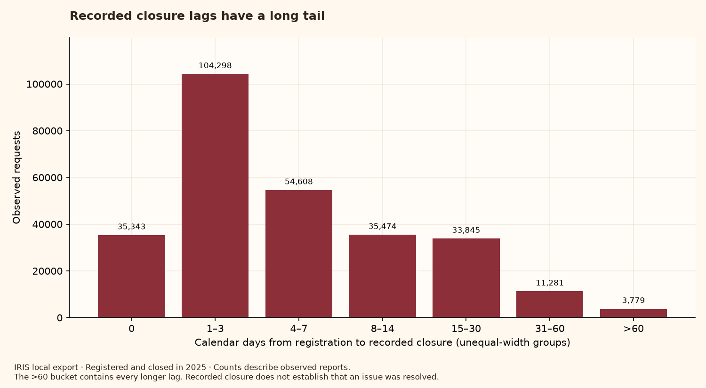

*Bars count records in labelled calendar-day ranges, which have unequal widths. The final >60 bar contains every longer lag; its height is a count, not a rate per day.*

The median recorded lag is 3 days: at least half the selected records close within that interval. The 95th percentile is 32 days, and 3,779 records (1.4%) take more than 60 days. The maximum in this 2025-registration cohort is 286 days.

Three days is a useful description of the middle of this distribution, but it says little about the people whose requests remain in the administrative process much longer. Showing the tail keeps those less typical cases in the conversation instead of allowing one reassuring central number to stand for everyone.

A recorded closure is not proof that the person considered the issue resolved. Still-open requests are absent, and late-year registrations have less time to contribute long lags. The full export's longer maximum of 580 days includes earlier registrations and belongs to a different comparison.

### 11. Different requests have different closure timelines

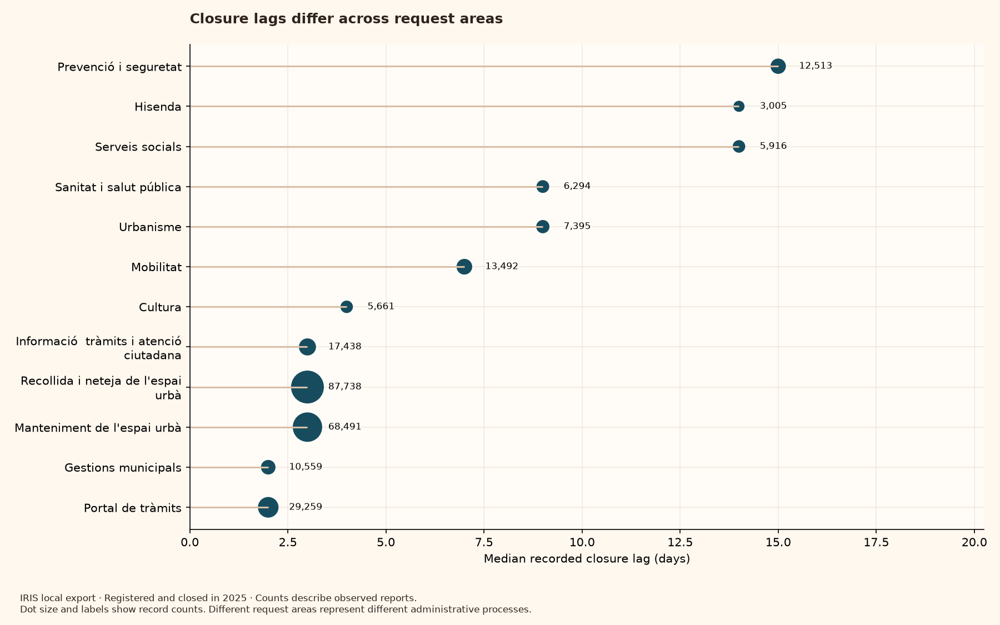

*A dot farther to the right means a longer median lag. Dot size and the adjacent number show report volume; the chart covers the twelve largest request areas.*

Cleaning has a median recorded lag of 3 days, and maintenance 3 days. Mobility (Mobilitat) has a median of 7 days, and prevention and safety (Prevenció i seguretat) 15 days. The categories with the largest volumes are not automatically those with the longest medians.

A question about a procedure and a report needing investigation need not follow the same administrative path. Looking at them separately makes the citywide median more understandable and gives us a fairer starting point for asking which processes might need closer study.

This is not a league table of good and bad service. The records do not make complexity, urgency, staffing, or the meaning of closure comparable across areas. The plot supports a question about differences in process; it does not identify their cause.

### 12. Busy days do not tell the whole story of closure lag

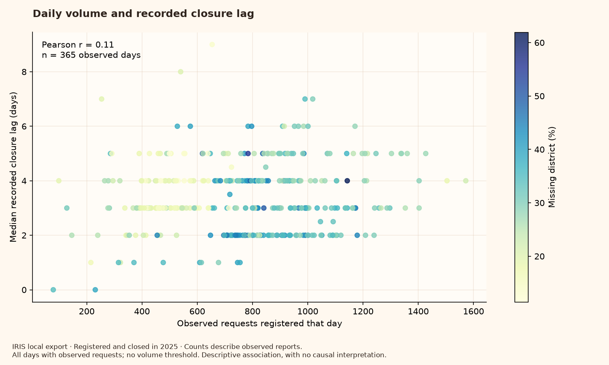

*Each dot is a registration day: left to right is its report count, and bottom to top is the median eventual recorded lag of those requests. Colour shows that day's percentage of records missing district.*

Across 365 observed days, the correlation is 0.11. This measure describes how consistently the two quantities move together in a straight-line pattern. A value close to zero, as here, indicates little such alignment; the dots do not form a clear rising line.

It is understandable to wonder whether more incoming requests mean longer waits. In this view, daily volume alone gives only a weak guide to the median lag. That directs attention to more specific questions about the kinds of requests received and the processes they enter.

The vertical axis is not how long that day's workload took to clear, and the plot does not measure backlog or staffing. Daily medians can hide long individual lags. Calendar effects, request mix, and the closure-year cutoff remain unadjusted, so a weak correlation cannot prove that workload has no effect.

### 13. The labels change, so the story needs a pause

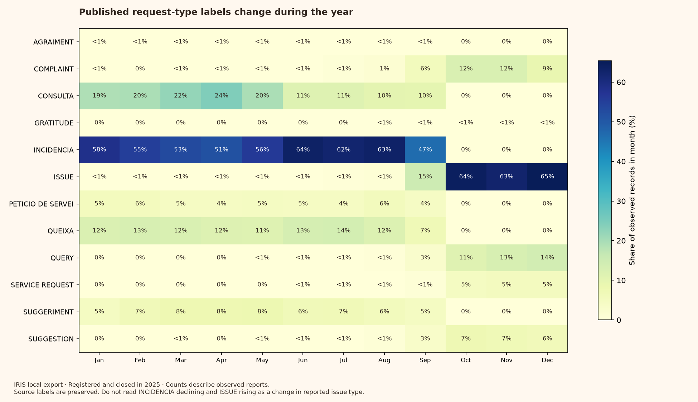

*Rows are request-type labels exactly as published; columns are registration months. Each cell is that label's share of the month's records. A <1% label indicates a small nonzero share.*

October contains 0 records labelled INCIDENCIA and 17,071 labelled ISSUE. Other apparent Catalan/English counterparts shift as well, and October–December uses the English labels. The timing suggests a change in publication or classification, although this file does not explain it.

Without checking the labels, we could tell a dramatic story about one type of problem disappearing and another surging. Looking closely protects the people and services represented here from a conclusion the records cannot support. Sometimes the most useful finding is that a comparison needs more work.

We preserve both labels and do not merge apparent translations without a documented mapping. They do not identify the language used by citizens. Before using request-type trends to describe changes in city life, we need the publisher's explanation and a check that the categories remained comparable.

<!-- END IRIS PLOT READINGS -->

## Reproduce the analysis

Use Python 3.11 and the existing dependencies:

```bash
python3.11 -m venv .venv
source .venv/bin/activate
python -m pip install -r requirements.txt
```

For the data already present in this workspace, regenerate everything visible:

```bash
python -m src.explore_iris_signals --readme-path README.md
python -m streamlit run streamlit_app.py
```

The analysis command validates the prepared schema, IDs, dates and closure
lags, then writes:

- the marked plot tour in `README.md` — all 13 figures and their interpretations;
- `reports/iris_signal_summary.md` — the same readings with supporting tables;
- `reports/iris_exploration.html` — a standalone report with embedded plots and CSVs;
- `reports/figures/` — 13 PNG plots;
- `data/processed/summaries/` — 13 aggregate CSVs, ignored by Git;
- `reports/iris_analysis_manifest.json` — input fingerprints, versions, and rules.

The README uses relative Markdown image paths, so GitHub can display every
plot directly when the README and PNGs are committed together. No running app,
external image host, or notebook execution is needed to read the plots.
Raw data, processed record-level data, and regenerated aggregate CSVs stay out
of Git. Aggregate tables are also embedded in the standalone report.

The plot interpretations live in `src/iris_interpretations.py`. The command
above recomputes the quoted numbers and updates only the marked plot section
of the README, preserving the introduction and setup instructions. Omit
`--readme-path` to regenerate the reports without editing the README.
The prose describes this inspected snapshot; review its interpretation when
changing source data.

To work from a fresh checkout, first discover and inspect the source:

```bash
python -m src.data_catalog
python -m src.data_catalog --download efc9fd4d-a812-427c-846d-a086d22012a4
python -m src.inspect_data data/raw/2025_IRIS_Peticions_Ciutadanes_OpenData.csv
python -m src.profile_iris data/raw/2025_IRIS_Peticions_Ciutadanes_OpenData.csv
python -m src.investigate_iris_quality data/raw/2025_IRIS_Peticions_Ciutadanes_OpenData.csv
python -m src.prepare_iris_dataset data/raw/2025_IRIS_Peticions_Ciutadanes_OpenData.csv
python -m src.explore_iris_signals --readme-path README.md
```

The download command refuses to overwrite an existing raw file. Catalog
metadata and download provenance are in [iris_catalog.md](reports/iris_catalog.md).
If the portal is unavailable, preserve an original CSV downloaded from the
[IRIS dataset page](https://opendata-ajuntament.barcelona.cat/data/en/dataset/iris)
in `data/raw/`, then inspect it before preparing data. A fresh remote download
may differ from this preserved snapshot; regenerate and inspect the outputs.

Output paths are configurable with `python -m src.explore_iris_signals --help`.
The current analysis explicitly expects the inspected **2025 closure-year**
schema and rejects inconsistent dates or duplicate identifiers.

Run the lightweight analytical and interface checks:

```bash
python -m unittest discover -s tests -v
python -m compileall -q src streamlit_app.py
```

## Project structure

```text
data/raw/                 Original downloads, never edited in place
data/processed/           Prepared records, summaries, and local caches
reports/figures/           Exported scientific/descriptive plots
reports/*.md              Profiles, decisions, and generated reading guide
reports/*.html            Standalone illustrated report
reports/*.json            Reproducibility manifest
src/iris_signals.py        Shared cohort, calendar, and composition calculations
src/explore_iris_signals.py CLI and static plots
src/iris_interpretations.py Per-plot narratives shared across all reading formats
src/iris_report.py         Markdown, offline HTML, and README narrative generation
src/*                     Discovery, inspection, quality, and preparation
streamlit_app.py           Existing local explorer over the same calculations
tests/                    Calendar, denominator, input, and interface regressions
```

## Next according to the plan

Before adding weather, inspect adjacent closure-year resources and define a
common follow-up window for registration cohorts. Verify category mappings
against publisher metadata. Those checks will determine which time comparisons
are defensible and which weather question can be tested.

Weather joins, regression, event context, anomaly detection, and forecasting
remain later work. See [PROJECT_PLAN.md](PROJECT_PLAN.md) for the milestones.
