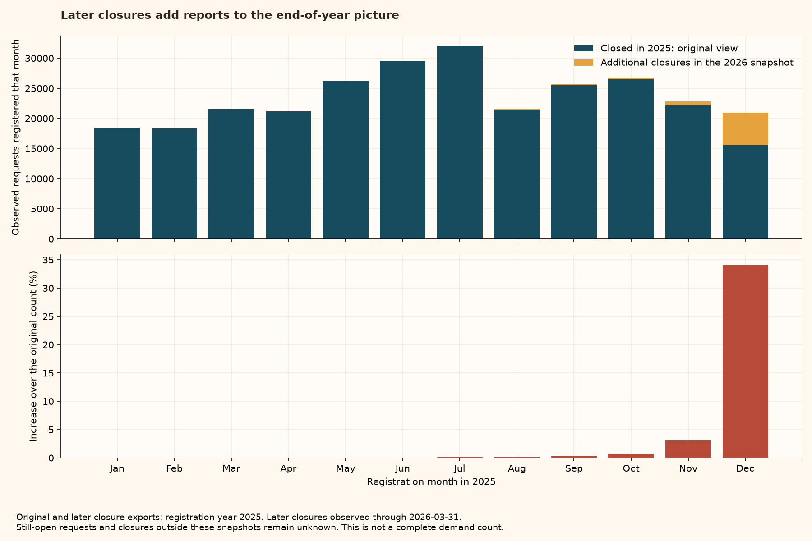

# What later closures change about the 2025 picture

**Takeaway: the 2026 snapshot adds 6,419 requests registered in 2025. December gains 5,331 records (34.2% above its original count).**

The new file was downloaded on 2026-10-02, but its latest recorded closure is **2026-03-31**. A recent download is not necessarily up-to-date coverage.



Read the blue bars as the original monthly counts and the gold segments as reports recovered from later closures. The lower panel shows the percentage added to each original count. December changes most: its count rises from 15,600 to 20,931. This demonstrates that the year-end selection changes the picture. It does not explain every monthly rise or fall.

A request can remain important to someone after New Year. Following it into the next export helps keep those longer administrative processes visible. Neither this combined count nor the original count includes every request that might still be open.

## Source and identity checks

| source                | deduplicated_rows | first_closure | last_closure |
| --------------------- | ----------------- | ------------- | ------------ |
| 2025 preserved export | 283911            | 2025-01-01    | 2025-12-31   |
| 2026 dated snapshot   | 70874             | 2026-01-01    | 2026-03-31   |

The inspected 2026 file has 72,326 raw rows and 25 columns; 1,452 exact duplicates were removed. The observed column names match the 2025 schema. IDs are unique after exact deduplication in each source, with no IDs shared between these snapshots. Dates and nonnegative closure lags were validated before combining. The original 2025 dataset and its 13-plot tour are preserved.

## Monthly comparison

| registration_month | original_records | later_closure_records | observed_combined_records | increase_percent | closed_within_30d | closed_within_90d |
| ------------------ | ---------------- | --------------------- | ------------------------- | ---------------- | ----------------- | ----------------- |
| 2025-01            | 18491            | 0                     | 18491                     | 0.0              | 17847             | 18431             |
| 2025-02            | 18331            | 2                     | 18333                     | 0.01             | 17617             | 18223             |
| 2025-03            | 21569            | 5                     | 21574                     | 0.02             | 20412             | 21418             |
| 2025-04            | 21147            | 4                     | 21151                     | 0.02             | 19832             | 20993             |
| 2025-05            | 26164            | 11                    | 26175                     | 0.04             | 24292             | 25984             |
| 2025-06            | 29517            | 13                    | 29530                     | 0.04             | 27463             | 29332             |
| 2025-07            | 32076            | 33                    | 32109                     | 0.1              | 29681             | 31938             |
| 2025-08            | 21470            | 50                    | 21520                     | 0.23             | 19974             | 21424             |
| 2025-09            | 25553            | 80                    | 25633                     | 0.31             | 24049             | 25531             |
| 2025-10            | 26546            | 213                   | 26759                     | 0.8              | 25165             | 26613             |
| 2025-11            | 22164            | 677                   | 22841                     | 3.05             | 21636             | 22758             |
| 2025-12            | 15600            | 5331                  | 20931                     | 34.17            | 19571             | 20899             |

The percentages above use the original monthly count as denominator. They are increases in observed records, not estimates of missingness among all citizen requests.

## An equal amount of follow-up time

**Primary descriptive outcome:** the daily number of observed requests registered in 2025 and administratively closed within 30 calendar days. **Sensitivity outcome:** the same count allowing 90 days. Include lag zero and the endpoint (30 or 90). Only include a registration date when that date plus the full period is on or before the last observed closure date.

All 365 calendar days in 2025 satisfy the 30-day date rule; 365 satisfy the 90-day rule. In these snapshots, 267,539 records meet the 30-day definition and 283,544 meet the 90-day definition. A December 31 registration has its 30-day endpoint on January 30 and its 90-day endpoint on March 31.

**What this makes comparable:** every included registration date gets the same allowed time to contribute a closed record. **What it does not fix:** unknown unpublished or still-open requests, changes in reporting, and differences in administrative processing. These counts describe requests that close within a fixed period; they are not total demand, a closure success rate, or the waiting time of all requests. The maximum observed date is a practical date boundary, not publisher certification of complete coverage.

## Classification stability and publisher documentation

| field        | later_unique_labels | new_labels | later_records_with_new_label |
| ------------ | ------------------- | ---------- | ---------------------------- |
| area         | 29                  | 2          | 5474                         |
| detail       | 972                 | 135        | 5619                         |
| element      | 332                 | 28         | 792                          |
| request_type | 6                   | 1          | 42527                        |

Exact source strings are compared without translation, accent removal, or merging. A new label may reflect spelling, classification, or a new kind of request; the table does not determine which.

The live catalog defines TIPUS as “Tipus de l'entrada”. This describes the field but supplies no mapping between its values. The 2026 snapshot uses INCIDÈNCIA, whereas the older export includes INCIDENCIA and ISSUE. A crosswalk is therefore still unverified. Do not compare or merge these labels as though equivalence had been established. The complete label audit, including area, element, and detail differences, is exported as iris_published_labels.csv.

## Next weather question and boundaries

Start with cleaning and collection, whose published AREA label appears in both exports. A shared name does not establish unchanged classification practices. Ask whether daily weather is associated with counts of those observed requests closed within 30 days, checking a 90-day definition and weekday/month differences. This concerns a selected group of reports, not all urban problems. Weather source selection and station/date validation must come before fitting a model. Unverified request-type translations will not be modelling inputs.

## Reproduce and inspect

```bash
python -m src.audit_iris_observation
```

Generated tables and the combined observed records are under `data/processed/observation_audit` (ignored by Git). Input fingerprints and rules are in [iris_observation_manifest.json](iris_observation_manifest.json). The new source profile is [iris_2026_profile.md](iris_2026_profile.md). Original downloads and the preserved catalog response remain in data/raw/.
