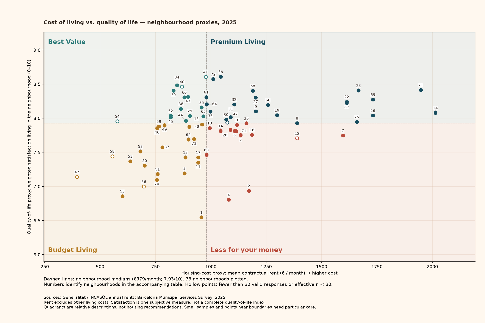

# Housing cost and neighbourhood satisfaction, 2025



**How to read it:** moving right means higher monthly rent; moving up means higher resident satisfaction. The numbered dots identify neighbourhoods in the table below. A point close to a dashed line could change category with a small change in the estimate.

The dividing lines are **€979.20/month** and **7.93/10**. Counts: Premium Living: 23, Budget Living: 22, Less for your money: 14, Best Value: 14.

A lower rent can make room in a household budget, while feeling good about the place you live matters too. These two measures help describe that trade-off, but do not tell us what any particular household can afford or which place will suit it.

## Definitions and limitations

Both axes use 2025 data. Rent is the annual mean monthly contractual rent from deposited INCASÒL rental bonds; the workbook publishes geolocated contracts and suppresses areas with fewer than six contracts. It does not measure groceries, utilities, household income or the rents of every existing tenant. Dwelling sizes and rental mix differ. Satisfaction is our PES-weighted mean of SATISF_RES_BARRI_0A10 in the official Municipal Services Survey. The endpoint text responses are decoded as 0 and 10; “NO HO SAP”, “NO CONTESTA” and missing responses are excluded. The unweighted valid response count and Kish effective sample size, (sum of weights)² / sum of squared weights, are shown. Hollow points flag either count below 30: this is a project caution rule, not an official reliability threshold. The survey supports grouped-neighbourhood reporting; these individual-neighbourhood estimates are exploratory, not official neighbourhood rankings, and we have not estimated design-based confidence intervals. The two AEI extensions in rent names (Poble Sec / Parc Montjuïc and Marina del Prat Vermell / Zona Franca) are explicitly matched to their residential neighbourhood names; published rent names are retained. Other names are matched after case, whitespace, apostrophe and hyphen-spacing normalization; all joins must be one-to-one. Cutoffs are unweighted medians across neighbourhoods with both measures, not citywide household averages. Ties go to the higher side; missing measures are never assigned a quadrant. Category names are relative labels, not judgments about residents, a causal claim or a recommendation to rent there.

## Every neighbourhood and its evidence

| code | neighbourhood                                | rent_eur_month | satisfaction | valid_responses | effective_n | small_sample | quadrant            |
| ---- | -------------------------------------------- | -------------- | ------------ | --------------- | ----------- | ------------ | ------------------- |
| 1    | el Raval                                     | 957.34         | 6.55         | 154             | 153.78      | False        | Budget Living       |
| 2    | el Barri Gòtic                               | 1172.05        | 6.94         | 153             | 152.78      | False        | Less for your money |
| 3    | la Barceloneta                               | 881.03         | 7.19         | 154             | 153.23      | False        | Budget Living       |
| 4    | Sant Pere, Santa Caterina i la Ribera        | 1081.06        | 6.81         | 155             | 154.06      | False        | Less for your money |
| 5    | el Fort Pienc                                | 1134.39        | 7.75         | 154             | 152.92      | False        | Less for your money |
| 6    | la Sagrada Família                           | 1106.99        | 7.81         | 154             | 152.98      | False        | Less for your money |
| 7    | la Dreta de l'Eixample                       | 1596.39        | 7.75         | 154             | 152.94      | False        | Less for your money |
| 8    | l'Antiga Esquerra de l'Eixample              | 1389.21        | 7.93         | 153             | 151.86      | False        | Premium Living      |
| 9    | la Nova Esquerra de l'Eixample               | 1203.27        | 8.1          | 154             | 152.93      | False        | Premium Living      |
| 10   | Sant Antoni                                  | 1118.45        | 7.9          | 154             | 152.44      | False        | Less for your money |
| 11   | el Poble Sec - AEI Parc Montjuïc             | 942.55         | 7.35         | 154             | 153.44      | False        | Budget Living       |
| 12   | la Marina del Prat Vermell - AEI Zona Franca | 1389.56        | 7.71         | 11              | 10.96       | True         | Less for your money |
| 13   | la Marina de Port                            | 885.1          | 7.43         | 143             | 142.35      | False        | Budget Living       |
| 14   | la Font de la Guatlla                        | 1043.88        | 7.81         | 34              | 33.87       | False        | Less for your money |
| 15   | Hostafrancs                                  | 959.63         | 7.91         | 53              | 52.79       | False        | Budget Living       |
| 16   | la Bordeta                                   | 1185.81        | 7.76         | 67              | 66.71       | False        | Less for your money |
| 17   | Sants - Badal                                | 942.87         | 7.43         | 59              | 58.52       | False        | Budget Living       |
| 18   | Sants                                        | 994.85         | 7.86         | 95              | 94.18       | False        | Less for your money |
| 19   | les Corts                                    | 1298.64        | 8.05         | 191             | 188.19      | False        | Premium Living      |
| 20   | la Maternitat i Sant Ramon                   | 1160.33        | 7.93         | 175             | 172.76      | False        | Less for your money |
| 21   | Pedralbes                                    | 1947.79        | 8.42         | 70              | 67.55       | False        | Premium Living      |
| 22   | Vallvidrera, el Tibidabo i les Planes        | 1613.61        | 8.24         | 16              | 15.79       | True         | Premium Living      |
| 23   | Sarrià                                       | 1666.96        | 8.41         | 83              | 81.6        | False        | Premium Living      |
| 24   | les Tres Torres                              | 2013.98        | 8.08         | 55              | 54.02       | False        | Premium Living      |
| 25   | Sant Gervasi - la Bonanova                   | 1658.79        | 7.95         | 69              | 67.85       | False        | Premium Living      |
| 26   | Sant Gervasi - Galvany                       | 1731.73        | 8.04         | 154             | 151.69      | False        | Premium Living      |
| 27   | el Putxet i el Farró                         | 1201.97        | 8.3          | 85              | 83.74       | False        | Premium Living      |
| 28   | Vallcarca i els Penitents                    | 1088.84        | 7.83         | 67              | 66.08       | False        | Less for your money |
| 29   | el Coll                                      | 905.57         | 8.04         | 32              | 31.63       | False        | Best Value          |
| 30   | la Salut                                     | 1068.66        | 7.98         | 55              | 54.3        | False        | Premium Living      |
| 31   | la Vila de Gràcia                            | 1089.93        | 8.02         | 154             | 152.96      | False        | Premium Living      |
| 32   | el Camp d'en Grassot i Gràcia Nova           | 1105.28        | 8.2          | 154             | 152.41      | False        | Premium Living      |
| 33   | el Baix Guinardó                             | 997.65         | 8.1          | 63              | 62.28       | False        | Premium Living      |
| 34   | Can Baró                                     | 846.8          | 8.48         | 35              | 34.52       | False        | Best Value          |
| 35   | el Guinardó                                  | 958.54         | 8.16         | 91              | 90.02       | False        | Best Value          |
| 36   | la Font d'en Fargues                         | 1044.46        | 8.61         | 41              | 40.24       | False        | Premium Living      |
| 37   | el Carmel                                    | 781.06         | 7.57         | 119             | 117.3       | False        | Budget Living       |
| 38   | la Teixonera                                 | 865.16         | 8.14         | 61              | 59.55       | False        | Best Value          |
| 39   | Sant Genís dels Agudells                     | 831.33         | 8.41         | 36              | 35.15       | False        | Best Value          |
| 40   | Montbau                                      | 869.98         | 8.46         | 24              | 23.41       | True         | Best Value          |
| 41   | la Vall d'Hebron                             | 976.16         | 8.61         | 28              | 27.09       | True         | Best Value          |
| 42   | la Clota                                     | 1073.66        | 7.94         | 5               | 4.93        | True         | Premium Living      |
| 43   | Horta                                        | 896.65         | 8.32         | 113             | 110.94      | False        | Best Value          |
| 44   | Vilapicina i la Torre Llobeta                | 887.81         | 7.96         | 67              | 65.59       | False        | Best Value          |
| 45   | Porta                                        | 818.77         | 8.01         | 64              | 62.72       | False        | Best Value          |
| 46   | el Turó de la Peira                          | 757.2          | 7.86         | 42              | 41.33       | False        | Budget Living       |
| 47   | Can Peguera                                  | 395.32         | 7.14         | 5               | 4.87        | True         | Budget Living       |
| 48   | la Guineueta                                 | 902.38         | 7.87         | 47              | 45.46       | False        | Budget Living       |
| 49   | Canyelles                                    | 791.01         | 7.9          | 37              | 36.76       | False        | Budget Living       |
| 50   | les Roquetes                                 | 701.28         | 7.31         | 87              | 86.67       | False        | Budget Living       |
| 51   | Verdun                                       | 759.21         | 7.18         | 41              | 40.04       | False        | Budget Living       |
| 52   | la Prosperitat                               | 818.6          | 8.04         | 85              | 82.6        | False        | Best Value          |
| 53   | la Trinitat Nova                             | 636.12         | 7.37         | 40              | 39.86       | False        | Budget Living       |
| 54   | Torre Baró                                   | 577.49         | 7.95         | 20              | 19.87       | True         | Best Value          |
| 55   | Ciutat Meridiana                             | 600.78         | 6.86         | 71              | 70.39       | False        | Budget Living       |
| 56   | Vallbona                                     | 697.54         | 7.0          | 9               | 8.98        | True         | Budget Living       |
| 57   | la Trinitat Vella                            | 681.85         | 7.51         | 64              | 63.53       | False        | Budget Living       |
| 58   | Baró de Viver                                | 554.77         | 7.44         | 16              | 15.92       | True         | Budget Living       |
| 59   | el Bon Pastor                                | 765.54         | 7.88         | 74              | 73.37       | False        | Budget Living       |
| 60   | Sant Andreu                                  | 880.33         | 8.31         | 163             | 162.23      | False        | Best Value          |
| 61   | la Sagrera                                   | 979.2          | 8.31         | 74              | 73.24       | False        | Premium Living      |
| 62   | el Congrés i els Indians                     | 898.32         | 7.69         | 36              | 35.62       | False        | Budget Living       |
| 63   | Navas                                        | 980.13         | 7.46         | 53              | 52.45       | False        | Less for your money |
| 64   | el Camp de l'Arpa del Clot                   | 981.62         | 8.2          | 92              | 91.36       | False        | Premium Living      |
| 65   | el Clot                                      | 966.25         | 8.03         | 62              | 61.52       | False        | Best Value          |
| 66   | el Parc i la Llacuna del Poblenou            | 1258.12        | 8.19         | 98              | 97.45       | False        | Premium Living      |
| 67   | la Vila Olímpica del Poblenou                | 1613.36        | 8.23         | 56              | 55.73       | False        | Premium Living      |
| 68   | el Poblenou                                  | 1189.53        | 8.4          | 112             | 110.89      | False        | Premium Living      |
| 69   | Diagonal Mar i el Front Marítim del Poblenou | 1731.71        | 8.27         | 42              | 41.61       | False        | Premium Living      |
| 70   | el Besòs i el Maresme                        | 756.22         | 7.1          | 81              | 80.76       | False        | Budget Living       |
| 71   | Provençals del Poblenou                      | 1114.63        | 7.81         | 73              | 72.78       | False        | Less for your money |
| 72   | Sant Martí de Provençals                     | 1011.05        | 8.57         | 72              | 70.64       | False        | Premium Living      |
| 73   | la Verneda i la Pau                          | 924.0          | 7.69         | 82              | 80.32       | False        | Budget Living       |

## Sources and reproduction

[Official rent workbook](https://habitatge.gencat.cat/web/.content/home/dades/estadistiques/01_Estadistiques_de_construccio_i_mercat_immobiliari/03_Mercat_de_lloguer/03_Lloguers_Barcelona_per_districtes_i_barris/anual_bcn_lloguer.xlsx); [official survey export](https://opendata-ajuntament.barcelona.cat/data/dataset/b1cc0c98-9912-4fed-9d75-f577b50a2e9e/resource/df3c3bd9-174c-48fd-831f-874309453039/download); [survey catalog and codebooks](https://opendata-ajuntament.barcelona.cat/data/en/dataset/esm-bcn-evo). Downloads inspected on 2026-10-06. The survey export includes historical years; only 2025 is used.

```bash
python -m src.neighbourhood_quadrants --download
```

Original files stay in data/raw/. The joined aggregate CSV is written to data/processed/neighbourhood_living_2025.csv. Source fingerprints are in neighbourhood_living_manifest.json. No IRIS counts enter either axis.
